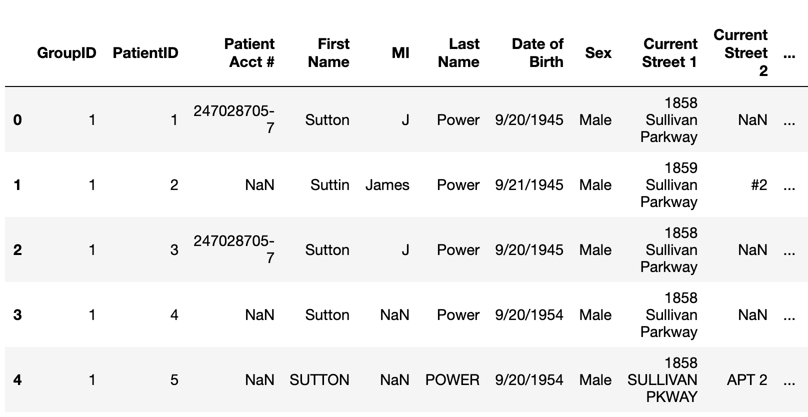
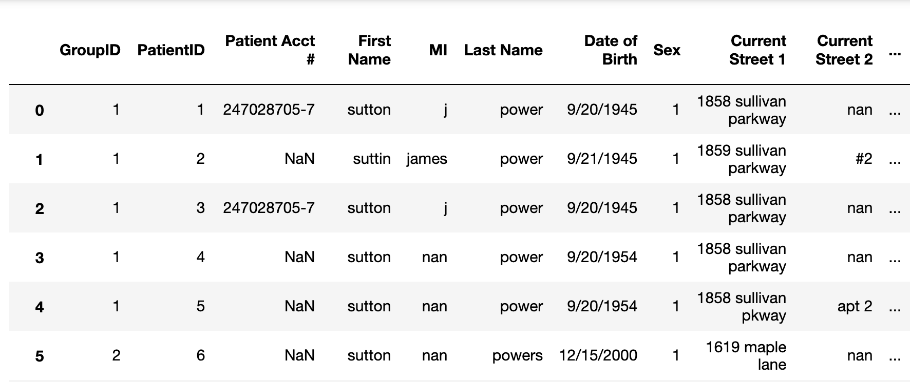
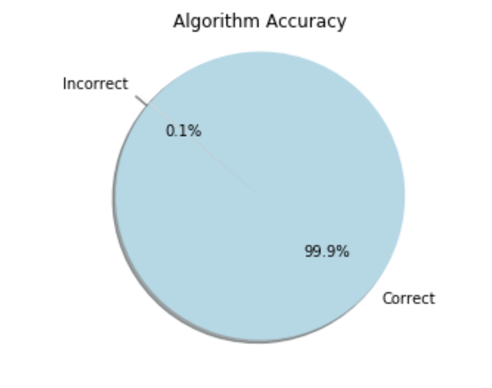
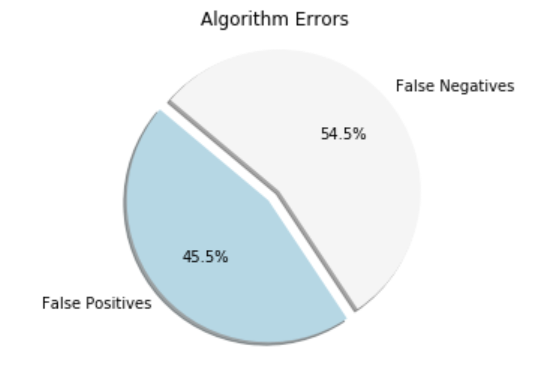

# LAHacks Challenge 1 - Patient Matching

## Predicting patient matches from incomplete data
### Tony Zhang and David Zhang

* * *

### 1) Introduction 

For this project, we decided to use an algorithm that employed levenshtein's algorithm to detect discrepencies between two patient fields and determine whether the patients are in the same group. With our modified algorithm, we were able to achieve **99.9% accuracy** on the test data set, without hardcoding to any specific patients in the given data set. We also considered other algorithms, such as soundex tokens and metaphone, but given the time constraint and the fact that levenshtein was able to accurately predict a large majority of patient matches, we did not implement any additional algorithms and left that for future work.

#### Data Cleaning
We performed basic data cleaning before running our algorithm. This included things like converting all alphabetic characters to lowercase, converting gender to a binary value, and removing non-alphanumeric characters for certain fields, to make comparison easier.

To handle null fields, if either patient had a null value in a certain field, we disregarded it, as we did not have enough information to make an informed guess based on any null value.

Before cleaning: 

   

After cleaning: 

   

#### Matching Algorithm

For the matching algorithm, we used levenshtein's algorithm to determine the edit distance between two fields (ie "Lara" and "Laura" would have an edit distance of 1 by removing the "u" in "Laura"). We evaluated the majority, but not all, fields (patient first name, last name, middle initial, date of birth, etc.), taking into consideration the importance of the field in correctly identifying a match. For example, first name + date of birth was a crucial combination, as two people with the same first name and date of birth (accounting for possible typos) are extremely likely to be the same person (as there is unlikely to be an error typing in the wrong first name *and* date of birth), whereas only taking into account last name + date of birth could lead to confusion if the two patients are twins. We tested various combinations of fields and used the one that provided the highest accuracy.

We used a bottom-up criteria when deciding if two patients were the same (ie had the same GroupID). When evaluating a field between two patients, if the edit distance was greater than a certain threshold, we counted it as an error. If the total number of errors amongst all fields evalauted was greater than 1, then we returned false (indicating that the two patients do not have the same GroupID)*. If the total number of errors was less than one, we returned true (indicating that the two patients do have the same GroupID).

>*The exception to this was for date of birth; if date of birth had more than 3 discrepencies, we automatically returned false since it is more likely that the patients with different DOB's are different people, rather than the same person, except with > 3 typos on the date of birth.

#### Accuracy

We measured accuracy by running each patient in the test dataset against every other patient, and comparing the result of the algorithm against whether the GroupID's actually matched. We were able to obtain 99.89% accuracy - out of 20100 total tests, 20078 tests were accurate, with only 10 false positives (matching two patients with different GroupIDs) and 12 false negatives (not matching two patients with the same GroupIDs). We modified the cutoff values for the algorithm to try to ensure as even a number of false positives and negatives as possible.

   

   

* * * 

